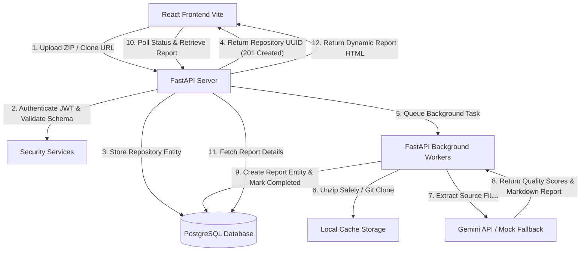

# CodeSage AI

[](https://www.python.org/downloads/)
[](https://react.dev/)
[](https://fastapi.tiangolo.com/)
[](LICENSE)
[]()

## Overview

CodeSage AI is a production-grade AI-powered code review platform. Built for engineering teams, it provides automated, intelligent code reviews using Google's Gemini LLM. It supports reviewing uploaded ZIP archives and cloned Git repositories, generating comprehensive Markdown reports with quality metrics. This project is built using Clean Architecture principles, ensuring scalability, maintainability, and robust security.

## Features

- **Automated Code Review**: Instantly analyze code repositories for bugs, best practices, and security vulnerabilities.
- **Git & ZIP Support**: Analyze code directly from public Git repositories or via local ZIP uploads.
- **AI-Powered Insights**: Integrates with Google Gemini API for deep semantic analysis of code logic.
- **Asynchronous Processing**: Background workers ensure the main API remains fast and responsive.
- **Interactive Dashboard**: Modern, glassmorphic React SPA to track review history and visualize quality metrics.
- **Secure by Default**: Features JWT authentication, `bcrypt` password hashing, and strict path traversal protections.
- **Robust Rate Limiting**: Redis-backed token bucket rate limiting to prevent abuse.

## Architecture

This system employs a decoupled, asynchronous Clean Architecture design. High-speed HTTP connections are maintained by offloading code analysis tasks to a background execution queue.

### Architecture Diagram



## Technology Stack

- **Backend**: Python 3.12, FastAPI, SQLAlchemy, Alembic, Pytest
- **Frontend**: React 18, TypeScript, Vite, Vanilla CSS
- **Database**: PostgreSQL (Primary Data), SQLite (Testing/Local)
- **Caching & Queues**: Redis
- **Containerization**: Docker, Docker Compose
- **AI Integration**: Google Gemini API
- **Security**: JWT (JSON Web Tokens), passlib (bcrypt)

## Folder Structure / Project Structure

```
codesage-ai/
├── backend/                      # Python Clean Architecture Backend
│   ├── app/
│   │   ├── api/                  # API Routers & Dependency Injection (V1)
│   │   ├── core/                 # Configurations, Security, Database, Redis Connections
│   │   ├── middleware/           # Audit Logging & Sliding-Window Rate Limiters
│   │   ├── models/               # SQLAlchemy Declarative Entities
│   │   ├── repositories/         # Query Object Abstractions (CRUD wrapper)
│   │   ├── schemas/              # Pydantic Schema Declarations & Input Validations
│   │   └── services/             # Business Logic (Git Cloner, Gemini Analyzer)
│   ├── alembic/                  # Database Migration Scripts
│   ├── tests/                    # Pytest Async SQLite Suite
│   ├── requirements.txt          # PIP Dependencies list
│   └── Dockerfile                # Production Container Config
├── frontend/                     # React Single Page Client Application
│   ├── src/
│   │   ├── services/             # API HTTP client mappings with JWT Auto-Refresh
│   │   ├── types/                # Unified TypeScript Type interfaces
│   │   ├── App.tsx               # SPA Views, States, and dynamic Markdown parser
│   │   ├── index.css             # Glassmorphic CSS design tokens
│   │   └── main.tsx              # Application entrypoint
│   ├── nginx.conf                # Multi-stage hosting configuration
│   └── Dockerfile                # Web asset server
├── docs/                         # Extended Engineering Documentation
├── assets/screenshots/           # UI and functionality screenshots
└── .github/workflows/            # CI/CD GitHub Actions
```

## Screenshots

*(Screenshots to be added)*
- **Login**: `assets/screenshots/login.png`
- **Registration**: `assets/screenshots/registration.png`
- **Dashboard**: `assets/screenshots/dashboard.png`
- **Repository Upload**: `assets/screenshots/upload.png`
- **Repository List**: `assets/screenshots/repo_list.png`
- **Analysis Report**: `assets/screenshots/report.png`
- **Swagger API**: `assets/screenshots/swagger.png`

## Installation

### Prerequisites
- Docker & Docker Compose
- Node.js 18+ (for local frontend development)
- Python 3.12+ (for local backend development)

## Configuration & Environment Variables

Copy `.env.example` to `.env` in the root directory and configure it:

```env
# Database Configuration
POSTGRES_USER=postgres
POSTGRES_PASSWORD=postgres_password_here
POSTGRES_DB=ai_code_review_db
DATABASE_URL=postgresql+asyncpg://postgres:postgres_password_here@db:5432/ai_code_review_db

# Redis
REDIS_URL=redis://cache:6379/0

# Security
SECRET_KEY=your_super_secret_key_change_me_in_production

# AI Settings
GEMINI_API_KEY=your_gemini_api_key_here
```

## Running with Docker (Recommended)

1. Clone the repository.
2. Set up your `.env` file as described above.
3. Start the stack:
   ```bash
   docker compose up --build -d
   ```
4. Access:
   - React Web App: `http://localhost`
   - API Docs: `http://localhost:8000/docs`

## Running Locally

To run without Docker (using SQLite for local dev):

**Backend:**
```bash
cd backend
python -m venv .venv
source .venv/bin/activate  # On Windows: .venv\Scripts\activate
pip install -r requirements.txt
uvicorn app.main:app --reload
```

**Frontend:**
```bash
cd frontend
npm install
npm run dev
```

Alternatively, use the provided PowerShell script on Windows:
```powershell
./run_local_sqlite.ps1
```

## API Documentation

The RESTful API endpoints are automatically documented using OpenAPI (Swagger UI). Once the backend is running, navigate to `/docs` (e.g., `http://localhost:8000/docs`) to interactively explore and test the endpoints.

See [docs/API.md](docs/API.md) for detailed endpoint specifications.

## Database Design

The application uses PostgreSQL as the primary data store. The database schema relies on SQLAlchemy ORM and Alembic migrations.

Entities include:
- `User`: Handles authentication and ownership.
- `Repository`: Tracks uploaded/cloned codebases.
- `ReviewReport`: Stores the AI's generated analysis and score metrics.

See [docs/Database.md](docs/Database.md) for detailed schema mapping.

## Authentication

Security is enforced via JWT (JSON Web Tokens). 
- Users authenticate to receive an `access_token`.
- The token must be passed in the `Authorization: Bearer <token>` header for protected routes.
- Passwords are natively hashed via `bcrypt` before storage.

## AI Analysis Pipeline

The platform uses Google's Gemini LLM to semantically analyze code files.
1. Code is uploaded via ZIP or cloned via Git URL.
2. Background workers traverse the directory and extract source code files, adhering to size limits and MIME types.
3. Extracted code is bundled into prompts and sent to the Gemini API.
4. Gemini returns structured JSON containing maintainability, security, and performance scores, alongside a Markdown-formatted review.
5. A fallback mock engine generates deterministic reports if the Gemini API key is not configured.

## Testing

The project includes an extensive async testing suite.

**Backend (Pytest):**
```bash
cd backend
pytest
```

**Integration & Validation Scripts:**
```bash
python test_api_endpoints.py
python validate_zip_uploads.py
```

See [docs/Testing.md](docs/Testing.md) for the complete QA strategy.

## Future Improvements

- Add support for GitHub/GitLab webhooks to trigger reviews automatically on Pull Requests.
- Implement language-specific AST parsing to filter out non-code assets before sending to the LLM.
- Implement WebSocket connections for real-time progress updates on the dashboard.

See [docs/FutureImprovements.md](docs/FutureImprovements.md) for the full roadmap.

## Contribution Guide

We welcome contributions! Please follow our clean architecture guidelines.
See [CONTRIBUTING.md](CONTRIBUTING.md) and [CODE_OF_CONDUCT.md](CODE_OF_CONDUCT.md) for details.

## License

Distributed under the MIT License. See [LICENSE](LICENSE) for more information.
